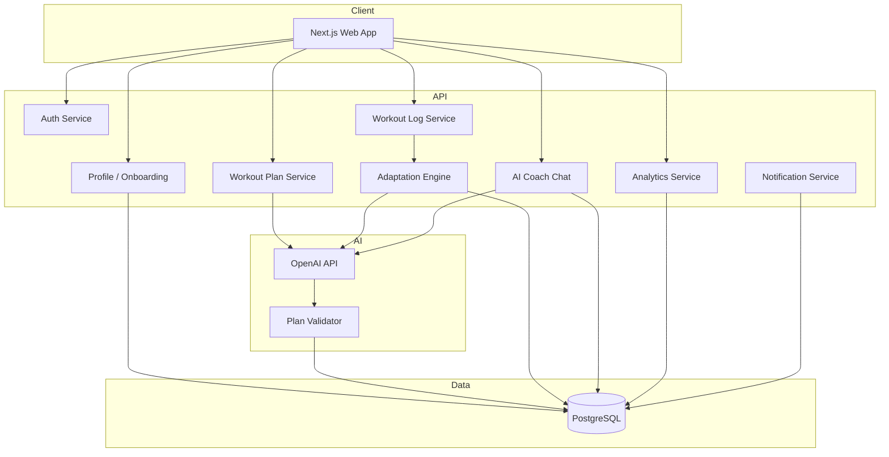

# Architecture – AI Personal Trainer

## Stack (implemented v0.1)

| Layer | Technology |
|-------|------------|
| Web | Next.js 15 (App Router), React 19, TypeScript, Tailwind — **UI pt-BR** |
| API | FastAPI (Python 3.12) — async, Pydantic v2 |
| DB | PostgreSQL 16 |
| ORM | SQLAlchemy 2 async (`create_all` no startup; Alembic em fase seguinte) |
| Auth | JWT email/senha (MVP) |
| AI | **Groq** free tier — `llama-3.3-70b-versatile`, JSON mode via OpenAI SDK |
| Exercises | **wger.de** public API — `language_id=7` (Português), sem API key |
| Jobs | Background tasks (FastAPI + Redis optional) for notifications — futuro |
| Storage | S3-compatible for progress photos (phase 2) |

Monorepo layout:

```
personal-ai/
├── apps/
│   ├── web/                 # Next.js frontend
│   └── api/                 # FastAPI backend
├── packages/
│   └── shared-types/        # OpenAPI-generated or hand-written TS types
├── docs/
│   ├── PRD.md
│   ├── TRAINING_GENERATION_RULES.md
│   └── ARCHITECTURE.md
└── docker-compose.yml       # postgres + api + web
```

---

## High-level flow



---

## Domain model (core entities)

```
User
  └── UserProfile (onboarding snapshot + editable)
  └── TrainingPlan (active plan, JSON program + metadata)
        └── PlannedWorkout (day in split)
              └── PlannedExercise
  └── WorkoutSession (actual log)
        └── ExerciseLog (sets, weight, rpe, notes)
  └── BodyMetric (weight, bf%, measurements, photo_url)
  └── PersonalRecord
  └── CoachMessage (chat thread)
  └── Notification
  └── Achievement / UserStreak (gamification)
```

---

## API surface (v1)

| Method | Path | Purpose |
|--------|------|---------|
| POST | `/auth/register` | Register |
| POST | `/auth/login` | JWT |
| POST | `/auth/forgot-password` | Reset flow |
| GET/PATCH | `/me/profile` | Onboarding + profile |
| POST | `/me/onboarding/complete` | Triggers plan generation |
| GET | `/me/plan/active` | Current program |
| POST | `/me/plan/regenerate` | Manual regen (rate limited) |
| GET | `/me/workouts/today` | Dashboard card |
| GET | `/me/workouts/:id` | Workout detail |
| POST | `/me/sessions` | Start session |
| PATCH | `/me/sessions/:id` | Log sets / complete |
| POST | `/me/sessions/:id/feedback` | Triggers adaptation |
| GET | `/me/progress` | Charts data |
| POST | `/me/metrics` | Body metrics |
| GET/POST | `/me/coach/messages` | Chat |
| GET | `/me/notifications` | In-app notifications |

---

## AI services

### 1. Plan generation (`POST /me/onboarding/complete`)

**Input context:** full profile JSON + `TRAINING_GENERATION_RULES.md` system rules.

**Flow:**

1. Build prompt from profile + rules.
2. Call OpenAI with `response_format: json_schema`.
3. Run `PlanValidator` (volume, duration, injuries).
4. Persist `TrainingPlan` + child rows.
5. Return plan summary to client.

### 2. Adaptation (`POST /me/sessions/:id/feedback`)

**Input:** session logs + last 3 sessions aggregates + active plan.

**Output:** `adaptation_type` + patch list; apply transactionally to next week’s plan.

### 3. Coach chat (`POST /me/coach/messages`)

**RAG-lite:** inject last 30 days metrics, active plan snippet, recent feedback — no vector DB required for MVP.

### 4. Insights (dashboard)

Scheduled or on-login: short bullet insights from trend SQL + optional LLM summary.

---

## Frontend routes

| Route | Screen |
|-------|--------|
| `/login`, `/register`, `/forgot-password` | Auth |
| `/onboarding/*` | 8-step wizard |
| `/dashboard` | Home |
| `/workout/[id]` | Active workout |
| `/progress` | Charts |
| `/profile` | Settings |
| `/coach` | Chat |

**State:** React Query for server state; Zustand for active workout session (timers, rest).

---

## Security

- Passwords: bcrypt
- JWT short-lived access + httpOnly refresh cookie
- Row-level ownership: all `/me/*` scoped by `user_id`
- Rate limit: plan regen, chat messages
- Never log OpenAI prompts with PII in production

---

## Implementation phases

| Phase | Scope |
|-------|--------|
| **0** | Docs, docker-compose, DB schema, auth |
| **1** | Onboarding UI + profile API + plan generation |
| **2** | Workout execution + logging + feedback |
| **3** | Adaptation engine + dashboard metrics |
| **4** | Coach chat + notifications |
| **5** | Gamification + polish (animations, PWA) |

---

## Environment variables

```env
# API
DATABASE_URL=
JWT_SECRET=
OPENAI_API_KEY=
CORS_ORIGINS=http://localhost:3000

# Web
NEXT_PUBLIC_API_URL=http://localhost:8000
```

---

## Decisions to confirm before scaffold

1. **Backend:** FastAPI vs Node — default FastAPI per PRD.
2. **Auth:** email/password only for MVP vs OAuth day one.
3. **Exercise library:** seed DB with ~200 exercises + video URLs vs external API.
4. **Language:** UI pt-BR vs en-US (PRD in English; product copy flexible).
